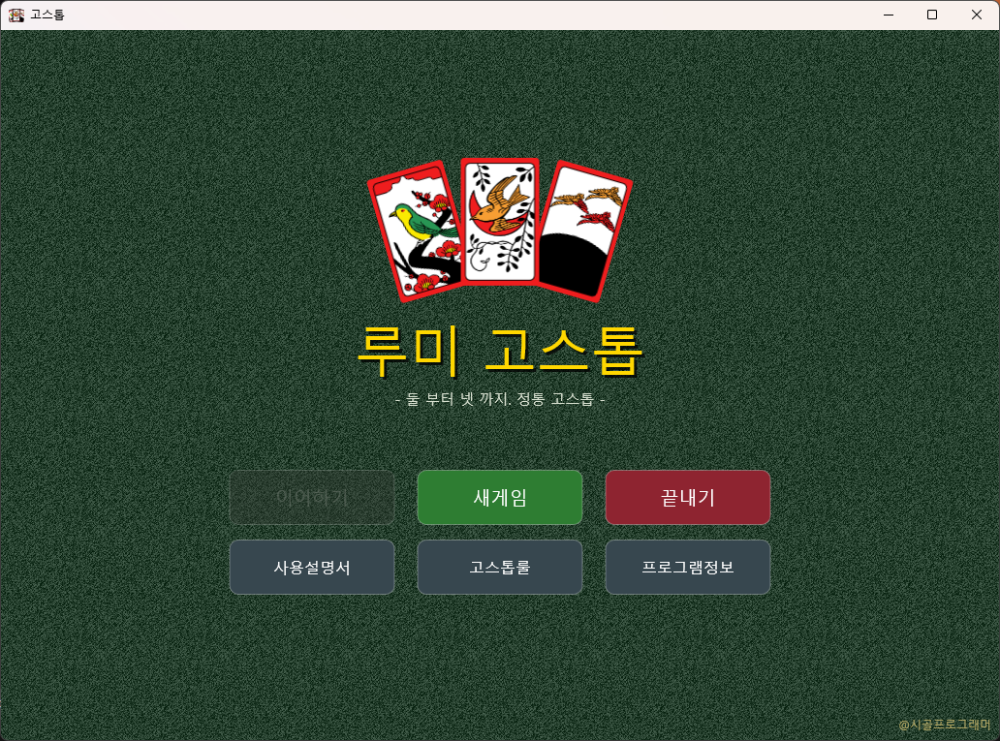

# 루미 고스톱 (Lumi Go-Stop)

**한국어** | [English](README.en.md)

한국 전통 화투 게임 **고스톱(맞고)**. Delphi FMX로 만든 2~4인 게임 코어 + UI + AI 상대.



<video src="docs/screenshots/playing.mp4" controls width="720">플레이 영상(docs/screenshots/playing.mp4)</video>

## 왜 만들었나

이 프로젝트는 약 40년 묵은 미완성 숙제다.

386도 아니고 **IBM XT(8086)** 시절, 터보 파스칼로 고스톱을 만들어보겠다고 덤빈 게 시작이었다. 결과는 실패. 그 뒤로도 몇 번을 더 도전했다 — 시대가 바뀔 때마다 한 번씩. 매번 이유는 비슷했다. 먹고사는 일이 바빠졌거나, 혼자 감당하기엔 규칙이며 UI며 기술적으로 벽에 부딪혔거나. 그렇게 몇 번을 만들다 접었다.

시간이 흘러 이제 슬슬 은퇴를 준비할 나이가 됐다. 그런데 요즘은 AI 덕분에 하루하루가 다시 재밌어졌다 — 예전 같으면 혼자 몇 달을 붙잡고 있어야 했을 일을 며칠 만에 시도해볼 수 있으니까. 그러던 어느 날 오래된 하드디스크를 뒤지다가, 옛날에 만들다 만 소스코드 뭉치를 발견했다. 먼지 쌓인 그 코드를 다시 열어보고, 이번엔 **클로드 코드(Claude Code)**와 함께 바이브 코딩으로 처음부터 다시 짰다.

40년 걸린 숙제 치고는, 결과물이 나쁘지 않다.

**제작 기간**: 본업 프로젝트 하다가 대기(빌드·배포 등) 걸리는 틈틈이 짬내서 작업 — 얼추 **5일** 걸렸다. 40년 묵혀둔 것치고는 완성까지 순식간이었던 셈.

**어떻게 만들었나**: **클로드 코드(Claude Code CLI)**로, **Opus 4.8**과 **Sonnet 5**를 번갈아 쓰며 작업했다.

### 만들고보니...

확실히 AI를 써서 코딩하니 속도는 물론이고, 혼자였으면 며칠 붙잡고 있었을 어려운 코드도 척척 풀어낸다. 그렇지만 프로그래밍의 본질 — "문제를 정의하고, 그걸 어떻게 풀어나갈 것인가" — 은 여전히 사람의 몫이다. 적어도 아직까지는.

AI의 발전 속도를 보면, 머지않은 미래엔 "고스톱 게임 만들어줘. 룰은 알아서 리서치해서 진행해" 이 한마디로 끝나버릴지도 모르겠다.

### 소회

만들어보겠다고 시도한 지 40년 만에, 거의 프로덕션급에 준하는 프로그램을 손에 쥐었다. 그런데 막상 완성하고 나니 좀 헛헛한 것도 사실이다. 하지만 이것도 AI 시대를 살아가는 개발자의 숙명이지 않을까 싶다.

## 무엇을 할 수 있나

- **2 / 3 / 4인 모드** — 4인은 정통 광팔기 협상까지 포함
- **전체 룰 구현** — 먹기 · 뻑(설사) · 따닥 · 쪽 · 쓸(싹쓸이) · 자뻑 · 연뻑 · 첫뻑 · 흔들기 · 폭탄 · 폭탄 페널티(뒤집기 전용 턴) · 총통 · 쓰리뻑 · 고/스톱 · 나가리
- **정산** — 광 · 열끗(고도리) · 띠(홍단/청단/초단) · 피(쌍피·3피), 피박 · 광박 · 고박 · 멍박, 국진(9월 열끗) 이중 해석(승자는 최고점, 패자는 피박 회피 우선)
- **AI 상대** — 능력치 하나로 실수율·고스톱 판단·수읽기·방어를 함께 조절하는 결정화 몬테카를로 AI, 캐릭터 20종(페르소나·말풍선 대사·감정별 아바타)
- **진행 저장 / 이어하기** — 언제 종료해도 자동 저장, 다음 실행 시 이어서 진행
- **사운드 · 애니메이션** — 상황별 효과음, 단계별 카드 애니메이션
- **인앱 도움말** — 타이틀 화면에서 사용설명서·고스톱룰 문서를 바로 브라우저로 열람

## 문서

- [게임 규칙 정본](docs/game-rules.md) — 엔진에 실제 구현된 규칙 문서
- [고스톱 완전정복](https://htmlpreview.github.io/?https://github.com/civilian7/gostop/blob/main/docs/gostop-guide.html) — 친구에게 설명하듯 정리한 규칙 가이드(카드 읽는 법 · 족보 · 특수 이벤트 · 가산룰)
- [사용설명서](https://htmlpreview.github.io/?https://github.com/civilian7/gostop/blob/main/docs/gostop-manual.html) — 타이틀 화면부터 정산까지 화면으로 보는 진행 방법

앱 안에서는 타이틀 화면의 **사용설명서 / 고스톱룰** 버튼으로 같은 문서를 바로 열 수 있다(`bin\help\`).

## 빌드

- Delphi 13 (RAD Studio 37.0), 타깃 Win64
- `powershell -ExecutionPolicy Bypass -File build.ps1` → `bin\Gostop.exe` (+ `bin\assets`, `bin\help` 동기화)
- 코어 룰/점수 엔진(`Gostop.Cards` · `Gostop.Deck` · `Gostop.Score` · `Gostop.Play` 등)은 FMX 의존 없이 `dcc64`로 단독 컴파일·검증 가능

## 구조

```
src/
  Gostop.dpr, Main.pas/.fmx     실행 진입점(폼은 보드 컨트롤에 위임)
  engine/                       게임 엔진 + UI 전체
    Gostop.Cards / Deck / Deal    카드 모델 · 셔플 · 딜링
    Gostop.Score / Play           족보 점수 · 턴 엔진(전체 룰)
    Gostop.AI                     능력치 기반 몬테카를로 AI
    Gostop.FourPlayer / FourGame  4인 광팔기 모드
    Gostop.Characters             캐릭터 페르소나 · 대사
    Gostop.Board.pas              메인 UI(렌더 · 입력 · 애니메이션)
    Gostop.SaveGame / Settings    저장 · 설정(gostop.ini)
    Gostop.Audio                  효과음 재생
assets/                        화투 이미지 · 아바타 · 오디오
docs/                          규칙 정본 · 가이드 · 사용설명서
help/                          앱이 여는 도움말 문서(build 시 bin\help 로 동기화)
```

## 라이선스

- 코드: **[PolyForm Noncommercial License 1.0.0](LICENSE)** — 비상업적 용도로만 사용 가능
- 화투 카드 이미지 48장: Wikimedia Commons, **CC BY-SA 4.0**(`assets/hwatu/attribution.tsv`)
- 효과음: **Kenney.nl**, CC0
- 조커 · 뒷장 이미지: 자체 제작(자유 사용)
- 아바타 이미지: **Google Gemini**로 생성

## 문의

버그 제보나 질문은 **civilian7@gmail.com** 으로.
